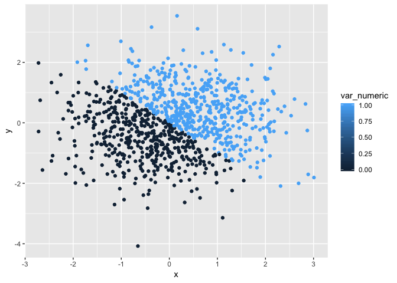
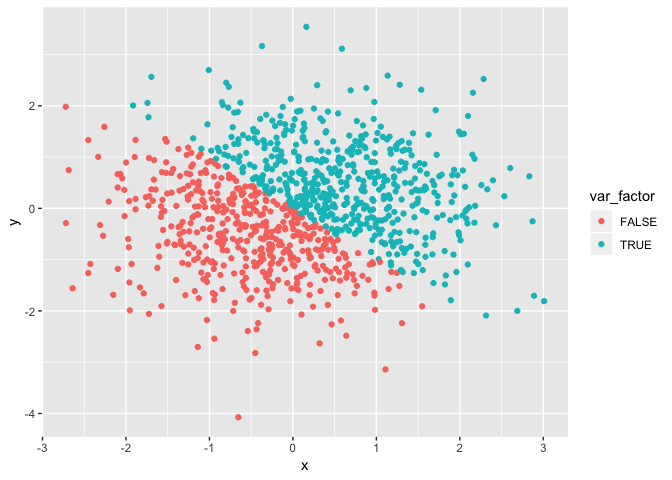

p8105\_hw1\_sc4456
================
Siyan Chen
9/18/2018

Porblem 1.
==========

``` r
# Creating A Data Frame
set.seed (1) 
type_numeric = runif(10, 0, 5)
type_logical = type_numeric > 2
type_charac = c ("a", "b", "c", "d", "e", "f", "g", "h", "i", "j")
type_factor = factor(c("North", "East", "South", "West", "North", "East", "South", "West", "North", "East"))
tibble(type_numeric, type_logical, type_charac, type_factor)
```

    ## # A tibble: 10 x 4
    ##    type_numeric type_logical type_charac type_factor
    ##           <dbl> <lgl>        <chr>       <fct>      
    ##  1        1.33  FALSE        a           North      
    ##  2        1.86  FALSE        b           East       
    ##  3        2.86  TRUE         c           South      
    ##  4        4.54  TRUE         d           West       
    ##  5        1.01  FALSE        e           North      
    ##  6        4.49  TRUE         f           East       
    ##  7        4.72  TRUE         g           South      
    ##  8        3.30  TRUE         h           West       
    ##  9        3.15  TRUE         i           North      
    ## 10        0.309 FALSE        j           East

mean of each variable
---------------------

``` r
mean(type_numeric)
```

    ## [1] 2.757569

``` r
mean(type_logical)
```

    ## [1] 0.6

``` r
mean(type_charac)
```

    ## Warning in mean.default(type_charac): argument is not numeric or logical:
    ## returning NA

    ## [1] NA

``` r
mean(type_factor)
```

    ## Warning in mean.default(type_factor): argument is not numeric or logical:
    ## returning NA

    ## [1] NA

numerical variable and logical vector variable works to get the mean; character vector and factor vector does not work. There is no numerical meaning for character vector and factor vectos, we get NA for their mean value. Logical vector have numerical have numerical meaning which consider True to be 1 and False to be 0.

test as.numeric function
------------------------

``` r
as.numeric(type_logical)
as.numeric(type_charac)
as.numeric(type_factor)
```

as.numeric function can convert logical vector e and factor vector to numberic values but does not work for character vector.

variable conversion
-------------------

``` r
# This is to convert character variable from character to factor to numeric
as.numeric(as.factor(type_charac))
```

    ##  [1]  1  2  3  4  5  6  7  8  9 10

``` r
# This is to convert factor varible from factor to character to numeric
as.numeric(as.character(type_factor))
```

    ## Warning: NAs introduced by coercion

    ##  [1] NA NA NA NA NA NA NA NA NA NA

``` r
# The results shows that first conversion is successful and the second conversion is not successful 
```

Problem 2
=========

``` r
# Creating A Data Frame
set.seed(2)
x = rnorm(1000, 0, 1)
y = rnorm(1000, 0, 1)
var_logical = x + y > 0
var_numeric = as.numeric(var_logical)
var_factor = as.factor(var_logical)
data_table2=tibble(x, y, var_logical, var_numeric, var_factor)
data_table2
```

    ## # A tibble: 1,000 x 5
    ##          x       y var_logical var_numeric var_factor
    ##      <dbl>   <dbl> <lgl>             <dbl> <fct>     
    ##  1 -0.897   0.466  FALSE                 0 FALSE     
    ##  2  0.185   0.955  TRUE                  1 TRUE      
    ##  3  1.59   -0.947  TRUE                  1 TRUE      
    ##  4 -1.13    0.0386 FALSE                 0 FALSE     
    ##  5 -0.0803 -0.831  FALSE                 0 FALSE     
    ##  6  0.132   0.557  TRUE                  1 TRUE      
    ##  7  0.708  -0.112  TRUE                  1 TRUE      
    ##  8 -0.240  -0.958  FALSE                 0 FALSE     
    ##  9  1.98   -0.468  TRUE                  1 TRUE      
    ## 10 -0.139   1.04   TRUE                  1 TRUE      
    ## # ... with 990 more rows

The size of of the dataset is 1000 observation and 5 variables. The mean of x is 0.0619987, the median of x is 0.0501354, the proportion of cases for which the logical vector is TRUE IS 0.53

plots
-----

``` r
ggplot(data_table2, aes(x = x, y = y, color = var_logical)) + geom_point() 
```


``` r
ggsave("data_table2_plot.pdf")
```

    ## Saving 7 x 5 in image

``` r
ggplot(data_table2, aes(x = x, y = y, color = var_numeric)) + geom_point()
```



``` r
ggplot(data_table2, aes(x = x, y = y, color = var_factor)) + geom_point()
```


